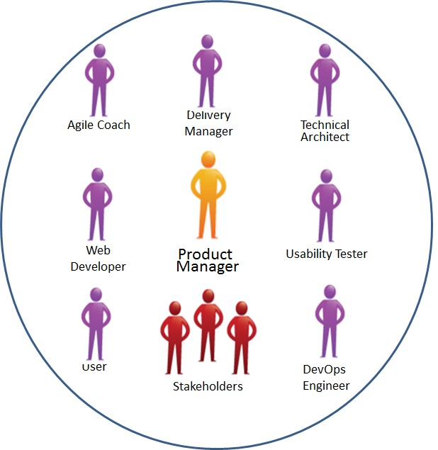
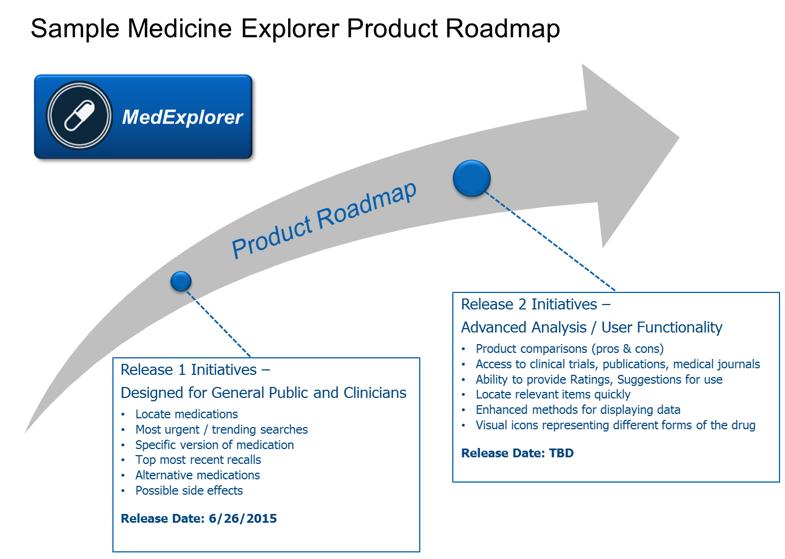

# Diagrams

## Agile User Centered Approach
This diagram shows the Agile User Centered Appraoch that we used to develop the MedExplorer project.

## Agile Team
This diagram shows our Agile team structure.

## User Centered Design Process
This diagram shows our User Centered Design Process that the MedExplorer team used to develop and desing the MedExplorer product concepts.

## Technology Stack
This diagram shows the technology stack that we used to build our MedExplorer application.

![Technology Stack] (MedExplorer_TechnologyStack.png)

## DevOps Diagram
This diagram shows the DevOps evnironment used on teh MedExplorer project.

## MedExplorer Product Roadmap
This diagram shows the product roadmap that was created during sprint review process.

## Logo
This diagram is our MedExplorer logo.

