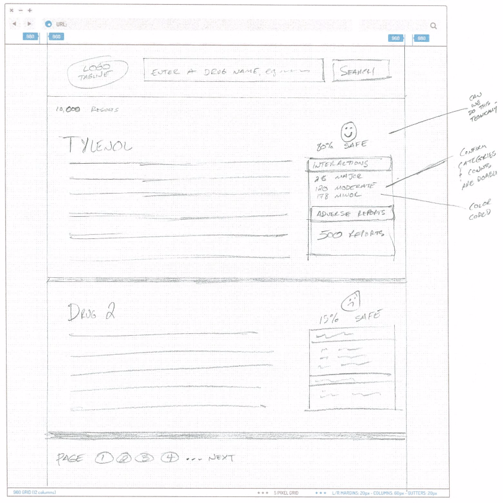
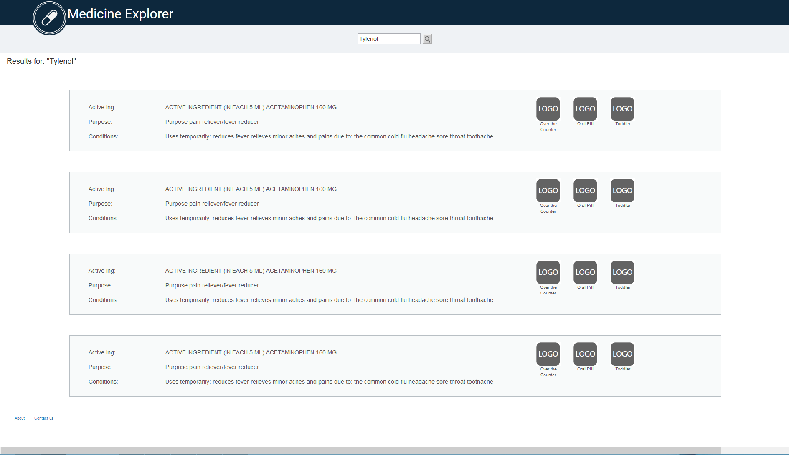

# Iterative Development

The MedExplorer application was built in a interative fashion in a collaboration with the user experience (UX) staff and the web developers.  We started out with a paper design concept from the UX staff.  This diagram was used to create Version 0 of the web application.  As we iteratived through a series of [wireframe diagrams] (../User Centered Design/Wireframes) and web applications, we used both the wireframes and web application to perform [user expectancy and usability tests](../User%20Centered%20Design/Readme.md#evaluation) that drove the evolution of the web application to its final versions.

## Initial Search Results Design Concept

## Version 0 of Browser Search Results

## Version 0.1 of Browser Search Results

## Version 1.0 of Browser Search Results

![Version 1.0 Search Results] (Screenshots/Version v1/MedExplorer_Search_Results_v1.png)

## Version 2.0 of Browser Search Results

![Version 2.0 Search Results] (Screenshots/Platforms/PC_Browser_SearchResults.png)
