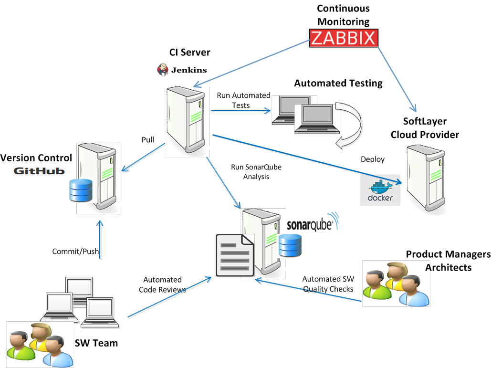
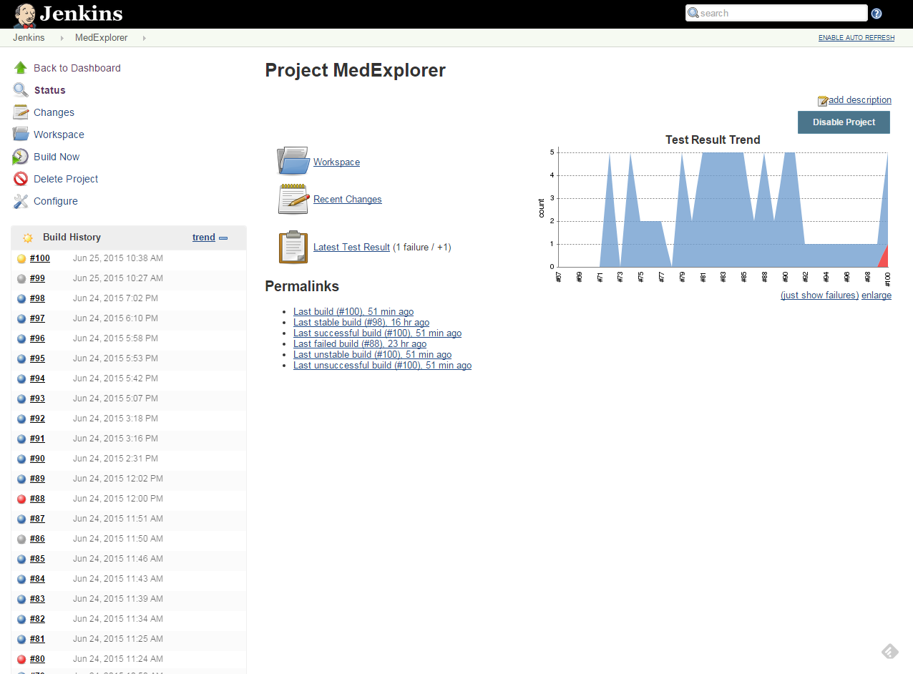
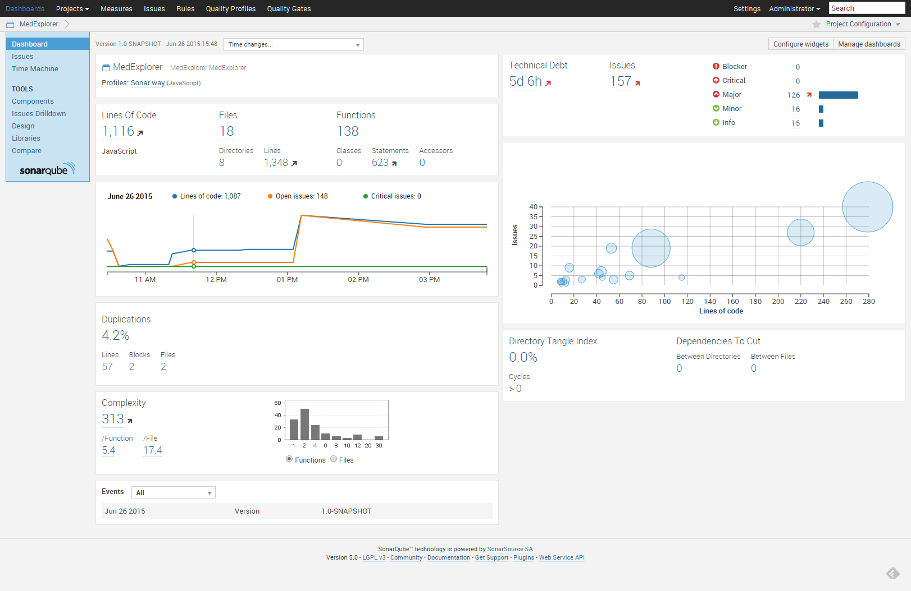

# DevOps

## Source Code Management

The MedExplorer development team is using an internally hosted Enterprise GitHub repository.  The development team is continuously updating the source code baseline as they do their development.

## Continuous Integration

Our continuous integration process uses a Jenkins CI server which is connected to our GitHub source code repository.  It monitors the source files in GitHub and when there is update to the repository, Jenkins builds and deploys new Docker containers to our development/test environment.  Jenkins then runs our automated tests.

### Jenkins Screenshot

## Automated Test

The MedExplorer team set up used automated unit testing for the MedExplorer baseline. There are two separate testing frameworks used: one for the front-end code and another for the back-end code. The front-end is using the Jasmine testing
framework, which is run by the Karma test-runner. The back-end code is tested using the UnitJS testing framework and is run by mocha. 

## Automated Software Quality

SonarQube is being used to perform automated software quality checks on the baseline.  SonarQube checks the code against the coding standards and languages specific coding issues and provides an automated quality score and an estimate of technical debt for the code baseline.  We used SonarQube to identify any Blocking and/or Critical coding errors and ensured that all were removed prior to delivery.  We also worked off the Major issues as time permitted.

### SonarQube Dashboard

## Continuous Delivery/Deployment

Our continuous delivery and deployment processes uses Jenkins to automate the creation and deployment of updated Docker containers to the production environment.

## Continuous Monitoring

As shown in our diagram we are using Zabbix to monitor our development/test and production environments.   Zabbix provides the ability to measure response time of the web server, CPU and memory utilization and other system measurements.  Below are pictures of the Zabbix dashbaord and some of the measurement graphs.

###MedExplorer Zabbix Dashboard

![Zabbix Dashboard] (../../Software Development/Screenshots/Continuous-Monitoring/MedExplorer_Zabbix_Monitoring.png)
