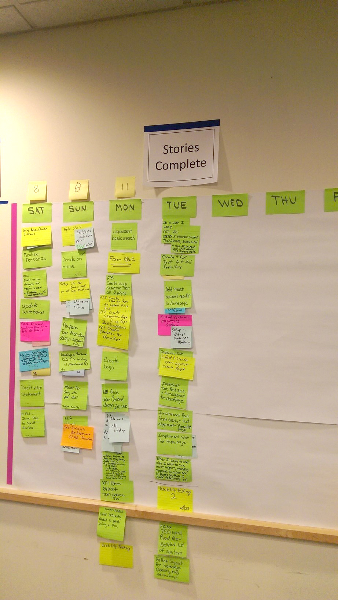
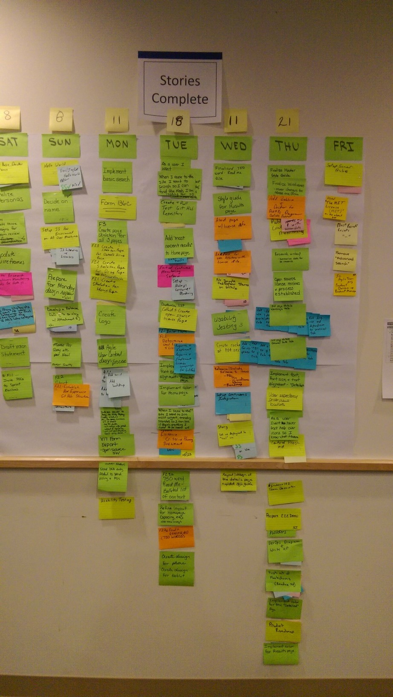

# User Stories

To better understand the needs of the users (Clinicians and General Public), we used proven user-centered design practices to conduct interviews, create user models to allow designers and developers to imagine what the user needs operationally to accomplish the mission at hand. This input helped the team to generate an initial product backlog of stories.

| As of Tuesday | Making further progress!! |
| ------------- |:-----------:|
|  |  | 

***
[Link to Sample user stories - not inclusive](Sample MedExplorer User Stories.xlsx)
***
