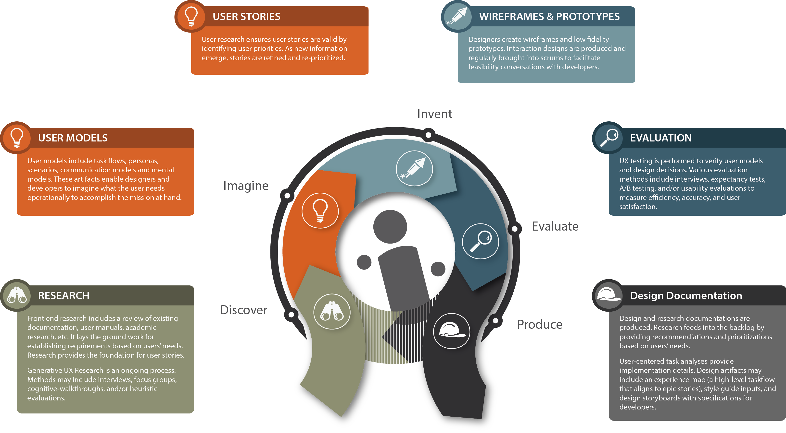

# User Centered Design

Our User Centered Design approach has 6 elements to its process.

## Research

Front end research includes a review of existing documentation, user manuals, academic research, etc. It lays the ground work for designs and establishing requirements based on users' needs. Generative UX Research is an ongoing process. Methods may include interviews, focus groups, cognitive-walkthroughs, and/or heuristic evaluations.

### User Models

User models include [task flows](Research Findings/Initial_Research_Findings.pdf), [personas] (Personas), [scenarios](Scenarios), communication models, and mental models. These artifacts enable designers and developers to understand what the users need operationally to accomplish the mission at hand, and what information they need to make decisions and complete tasks. We generated two personas for the MedExplorer project, [Kent Nelson, Doctor] (Personas/Persona_Clinician.png) and [Emma Jones, Consumer] (Personas/Persona_General_Public.png).

![General Consumer Persona] (Personas/Persona_General_Public.png)

### User Stories

User research ensures user stories are valid by identifying user priorities. As new information emerges, [experience maps](Experience Map/Experience Map.png) are generated and stories are refined and re-prioritized. These stories will inform the product backlog for future Agile sprints, as well as completion criteria. Our initial interviews were parsed into [user stories](../Software Development/User-Stories) for each consumer and incorporated into the project backlog.

![Experience Maps] (Experience Map/Experience Map.png)

## Wireframes & Prototypes

Designers create [wireframes] (Wireframes) and low fidelity prototypes. Interaction designs are produced and regularly are brought into the scrums to facilitate feasibility conversations with developers.

### Design Ideas

The design group processed the [generative research](Research Findings/Generative_Research.pdf) and user stories to produce design ideas, a series of tools and interaction patterns that could be used to achieve the stated [product vision](../Vision Statement.md).

### Initial Wireframes

We refined and combined our Design Ideas into a single draft wireframe that was reviewed by the entire team. Designers also arranged and configured the available information to make the most important data the most visible.  The initial wireframe is located at [Wireframes/Initial Wireframes] (Wireframes/Initial Wireframes/wireframe_v01_06202015.pdf). They were shown to users for the initial [expectancy tests](Research Findings/Expectancy_Tests.pdf).  We iterated through a number of version of wireframes as we refined our wireframes, examples are shown here ([Wireframe v1](Wireframes/Initial Wireframes/Wireframe_v01.pdf), [Wireframe v4](Wireframes/Initial Wireframes/Wireframe_v04.pdf), [Wireframe v5](Wireframes/Initial Wireframes/Wireframe_v05.pdf), [Wireframe v9](Wireframes/Initial Wireframes/Wireframe_v09.pdf))

## Evaluation

We conducted usability studies with real users, to verify user models and design decisions. For this project we employed interviews, expectancy tests, comparison testing, and focus groups to measure efficiency, accuracy, and user satisfaction. Our team conducted [expectancy tests](Research Findings/Expectancy_Tests.pdf) with seven users, to validate our designs, work flows, and information architecture.  Users were able to successfully complete tasks and find desired information 92% of the time.  We also conducted a focus group with six users to review our final designs for release 1, to help us identify weaknesses that could be fixed in release 2. The results of our focus group is documented in out [focus group report](Research Findings/Focus_Group.pdf).

## Design Documentation

Design documentation was produced to help the developers understand the design group decisions, how the product was meant to look, fell, and behave.  Color schemes, font choices, and design patterns were included in the project [style guide](Design Style Guide/Style_Guide_06212015.pdf) and Design Documentation.

### Final Wireframes

The user feedback and designs were shown to developers in ongoing discussions during each sprint to ensure the designs’ deliverability.  The designs were altered to meet the user expectations and to be executable within the sprint schedule, resulting in the [Final Wireframes](Wireframes/Final Wireframes).

